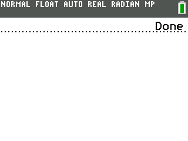

# TI84 3D CE-T Graph Calculator (Under Construction)

It uses a custom 3D libary, to display 3D graphs unto the TI84 CE-T Calculator

## Example of the Custom Libary, rendering a Cube and rotating it

## Example of rendering a 3-Dimensional Graph

Example uses the Equasion of z = x, but you could use everything. X&Y are the changing variables, meaning everything else will be threathed as constans.

### Example with  sin(x) + cos(y):

It works with every Equasion, you could possible write in the normal inbuild Y Editor.

# Controls

With arrow keys you can control the whole world rotation, so you can see the graph from the best angle.

The top keys are responsible for accessing sub menus or other stuff, that are listed there.

To Quit, you can use the F5 key or 'clear', 'del' or 'quit'/'mode' (same button)

##
[[Similar Project]](https://github.com/KermMartian/Graph3DC/tree/main)
