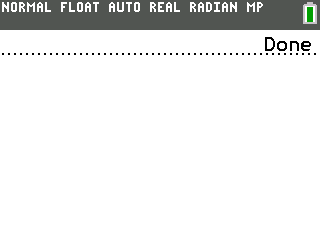

# TI84 3D CE-T Vector Calculator (Under Construction)

It uses a custom 3D libary, to display 3D Vectors unto the TI84 CE-T Calculator. D3Vector is the D3Graph successor for caluculating with three dimensional Vectors, while also rendering the position of each Vector for better understanding

## Example of the Custom Libary, rendering a Cube and rotating it

## Example of setting the Renderer Up

# Controls

With arrow keys you can control the whole world rotation, so you can see the graph from the best angle.

The top keys are responsible for accessing sub menus or exiting.

To Quit, you can use the F5 key or 'clear', 'del' or 'quit'/'mode' (same button)

## Similar project of the Main Branch
[[Similar Project]](https://github.com/KermMartian/Graph3DC/tree/main)
